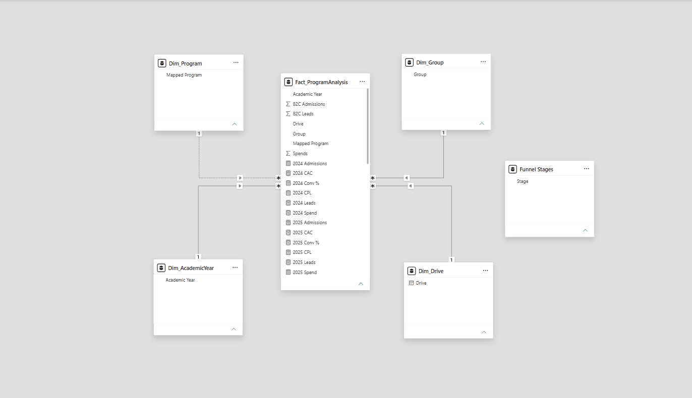
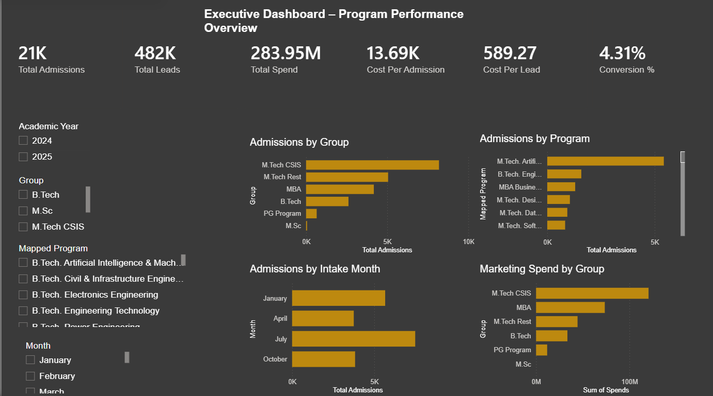
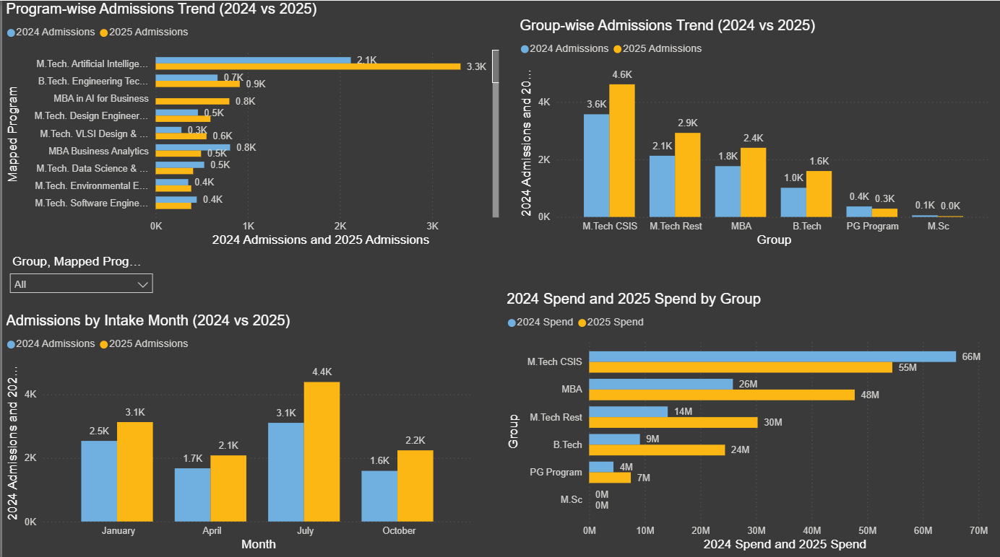
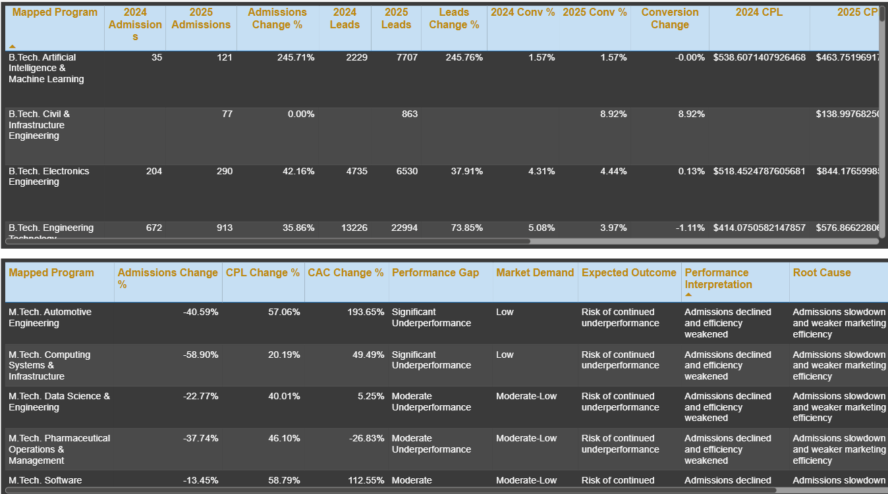
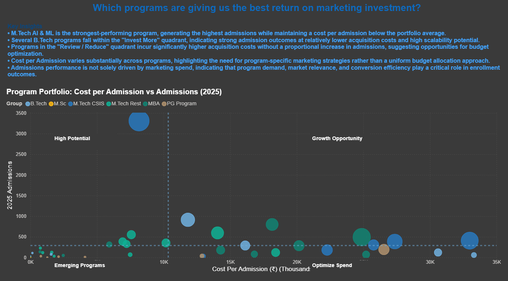
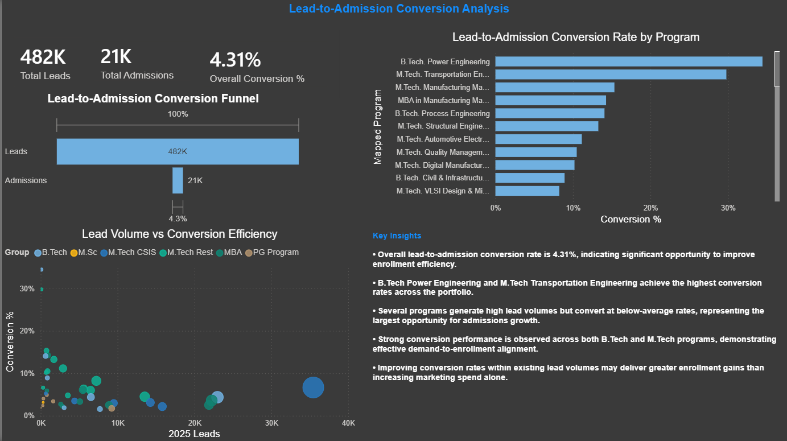

# 🎓 Marketing ROI Optimization for Higher Education

## 📌 Project Overview

This Power BI solution analyzes marketing effectiveness across academic programs and evaluates how marketing investments influence student admissions.

The dashboard helps decision-makers:

- Identify high-performing programs
- Measure marketing ROI
- Analyze lead-to-admission conversion efficiency
- Optimize budget allocation
- Improve enrollment outcomes

---

## 🚀 Business Problem

Educational institutions invest significant budgets in marketing campaigns, but determining which programs generate the best admissions outcomes remains challenging.

This project provides a data-driven framework to evaluate:

- Marketing Spend
- Leads Generated
- Admissions Achieved
- Cost Per Lead (CPL)
- Cost Per Admission (CAC)
- Conversion Efficiency

---

## 🛠 Tools & Technologies

- Power BI
- DAX
- Power Query
- Data Modeling
- Star Schema Design
- Business Intelligence

---

## 📊 Data Model

The solution follows a star schema design with a central fact table and supporting dimensions.



---

## 📈 Key KPIs

### Marketing Metrics
- Total Spend
- Cost Per Lead (CPL)
- Cost Per Admission (CAC)

### Admissions Metrics
- Total Admissions
- Admission Growth %
- Conversion Rate %

### Lead Metrics
- Total Leads
- Lead Growth %
- Lead-to-Admission Conversion %

---

# Dashboard Pages

## 1️⃣ Executive Dashboard

Provides a high-level overview of admissions performance, marketing spend, leads, and conversion metrics.



---

## 2️⃣ Year-over-Year Trend Analysis

Compares 2024 and 2025 performance across admissions, leads, and marketing spend.



---

## 3️⃣ Program Performance Analysis

Evaluates individual program performance and identifies growth opportunities.



---

## 4️⃣ Marketing Efficiency Analysis

Analyzes return on marketing investment and identifies programs requiring optimization.



---

## 5️⃣ Lead Conversion Funnel Analysis

Measures lead-to-admission conversion effectiveness across programs.



---

## 📌 Key Insights

- M.Tech AI & ML generated the highest admissions volume.
- Several B.Tech programs delivered strong admissions at lower acquisition costs.
- Marketing spend alone does not guarantee admissions success.
- Conversion efficiency is a major driver of enrollment performance.
- Certain programs present strong growth opportunities with optimized spending.

---

## 📂 Repository Structure

```
Assets/
│
├── Program Analysis 2024-2025.pbix

Dashboard_Screenshots/
│
├── Executive_Dashboard.png
├── YoY_Trends.png
├── Program_Analysis.png
├── Marketing_Efficiency.png
└── Lead_Conversion_Funnel.png

Documentation/
│
└── Data_Model.png
```

---

## 👨‍💻 Author

**Gourav Dutta**

Power BI | Data Analytics | Business Intelligence

GitHub: https://github.com/gouravinsights
